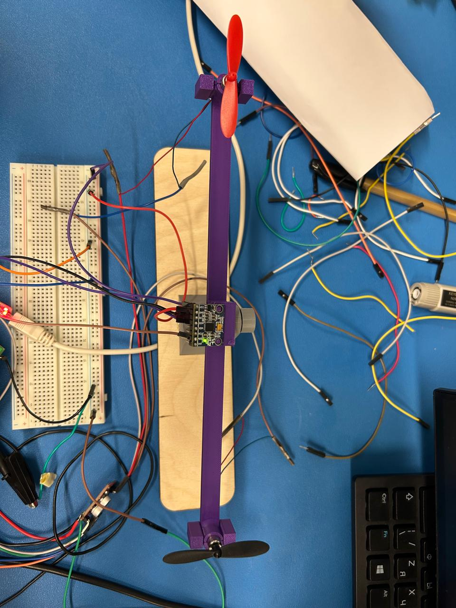
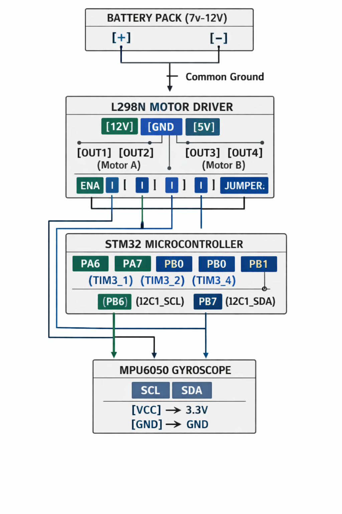

# ⚖️ Self-Balancing Seesaw (STM32)

A **self-balancing seesaw system** built using an **STM32 microcontroller** and **PID control** to maintain balance in real time.

This project demonstrates core concepts of **embedded systems**, **sensor fusion**, and **control systems**.

---

## 🎯 Project Objective

The goal of this project is to keep a physical seesaw balanced by:
- Measuring tilt using an **MPU6050 IMU**
- Computing error from the desired angle
- Applying **PID control**
- Driving motors via PWM to counteract tilt

---

## 🛠️ Tech Stack

- **Microcontroller:** STM32F030
- **Programming Language:** C
- **IDE:** STM32CubeIDE
- **Sensors:** MPU6050 (Accelerometer + Gyroscope)
- **Control Algorithm:** PID Controller
- **Communication:** I2C
- **Motor Control:** PWM

---

## 🧠 How It Works

1. MPU6050 continuously measures the seesaw angle
2. Error is calculated against a target angle
3. PID controller computes correction
4. PWM signal drives the motor
5. System stabilizes dynamically in real time

---

## 📂 Project Structure

```
self-balancing-seesaw/
│
├── firmware/ # STM32 firmware source code
│ ├── Core/
│ ├── Drivers/
│ └── TRYING.ioc
│
├── hardware/ # Hardware setup & demo
│ ├── seesaw.jpeg
│ ├── wire-setup.png
│ └── demo-video.mp4
│
├── README.md
```

---

## 🖼️ Hardware Setup

### Seesaw Assembly


### Wiring Diagram


---

## 🎥 Demo Video

Click the image below to download and watch the demo:

[](hardware/demo-video.mp4)


---

## 🧠 What I Learned

- Implementing PID control in embedded systems
- Sensor calibration and noise handling
- Real-time motor control using PWM
- STM32 HAL and peripheral configuration
- Translating control theory into hardware

---

## 🚀 Future Improvements

- Auto-tuning PID parameters
- OLED display for live angle data
- Bluetooth monitoring
- Improved mechanical stability

---

### 👩‍💻 Author
**Alisha Bukhari**  
Computer Engineering | Embedded Systems | STM32

